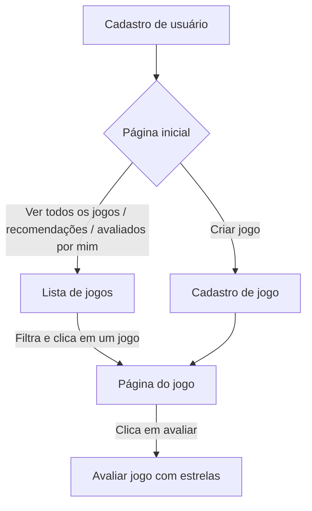

# Projeto de Interface

## User Flow

```mermaid
flowchart TD
    A[Cadastro de usuário] --> B{Página inicial}
    B --> | Ver todos os jogos / recomendações / avaliados por mim| C[Lista de jogos]
    C --> | Filtra e clica em um jogo | D[Página do jogo]
    B --> | Criar jogo | E[Cadastro de jogo]
    E --> D
    D --> | Clica em avaliar | F[Avaliar jogo com estrelas]
 

```

## Wireframes

### Login

### Página Inicial

### Lista de Jogos

### Página de Jogo

### Cadastrar jogo

